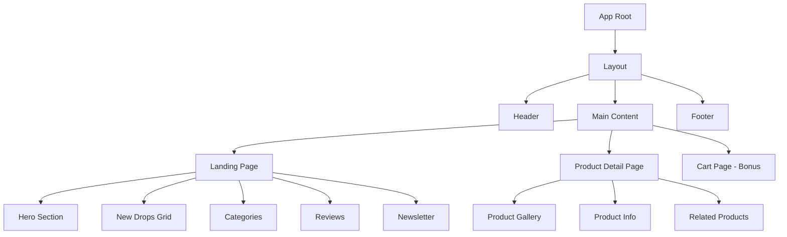

# KICKS E-Commerce Platform - Product Requirements Document

## Project Overview

**Project Name:** KICKS Frontend Implementation  
**Organization:** Zavisoft  
**Version:** 1.0  
**Due Date:** February 23, 2026 - 11:59 PM  
**Document Type:** Product Requirements & Development Roadmap

---

## Table of Contents

1. [Executive Summary](#executive-summary)
2. [Project Vision & Goals](#project-vision--goals)
3. [Technical Stack](#technical-stack)
4. [System Architecture](#system-architecture)
5. [Feature Specifications](#feature-specifications)
6. [API Integration](#api-integration)
7. [Design System](#design-system)
8. [Development Roadmap](#development-roadmap)
9. [Implementation Plan](#implementation-plan)
10. [Quality Assurance](#quality-assurance)
11. [Evaluation Criteria](#evaluation-criteria)
12. [Deliverables](#deliverables)
13. [Resources](#resources)

---

## Executive Summary

### Project Description

KICKS DROP is a modern multi-category e-commerce platform. This project involves building a responsive, high-performance frontend application that translates Figma design specifications into a production-ready React/Next.js application with seamless API integration.

### Key Objectives

- **Design Fidelity:** Achieve 90%+ accuracy in translating Figma designs to code
- **Performance:** Build a fast, responsive application optimized for all devices
- **Code Quality:** Demonstrate clean architecture and best practices
- **User Experience:** Implement comprehensive UI states for optimal UX
- **API Integration:** Seamlessly connect with Platzi Fake Store API

### Success Metrics

| Metric | Target | Priority |
|--------|--------|----------|
| Design Match | 90%+ accuracy | High |
| Mobile Responsiveness | 100% functional | High |
| API Integration | Full CRUD operations | High |
| Loading Time | < 3s initial load | Medium |
| Code Coverage | Clean, documented code | High |
| Commit Quality | Meaningful history | Medium |

---

## Project Vision & Goals

### Business Goals

1. **Showcase Development Skills:** Demonstrate proficiency in modern frontend technologies
2. **User-Centric Design:** Create an intuitive shopping experience
3. **Scalable Architecture:** Build a foundation for future enhancements
4. **Performance Optimization:** Ensure fast load times and smooth interactions

### Technical Goals

1. **Component Reusability:** Build modular, reusable components
2. **State Management:** Implement efficient global and local state handling
3. **API Integration:** Create robust data fetching with caching
4. **Responsive Design:** Support mobile, tablet, and desktop devices
5. **Error Handling:** Comprehensive error boundaries and fallbacks

### User Goals

1. **Browse Products:** Easy navigation through product catalog
2. **View Details:** Access comprehensive product information
3. **Shopping Cart:** Add items and manage cart (bonus feature)
4. **Search & Filter:** Find products efficiently
5. **Smooth Experience:** Fast, responsive, and intuitive interface

---

## Technical Stack

### Core Technologies

```
Framework:        React OR Next.js
State Management: Redux OR Context API
Data Fetching:    RTK Query OR Axios
Language:         JavaScript OR TypeScript (TypeScript recommended)
Styling:          Tailwind CSS (Required)
Component Lib:    Any (Optional - shadcn/ui, MUI, etc.)
```

### Recommended Stack

**Option 1: Modern Next.js Stack (Recommended)**
```bash
- Next.js 14+ (App Router)
- TypeScript
- Redux Toolkit with RTK Query
- Tailwind CSS
- shadcn/ui components
```

**Option 2: React Stack**
```bash
- React 18+
- TypeScript
- Context API + React Query
- Tailwind CSS
- Custom components
```

### Development Tools

- **Version Control:** Git with conventional commits
- **Package Manager:** npm, yarn, or pnpm
- **Code Quality:** ESLint, Prettier
- **Deployment:** Vercel, Netlify, or similar
- **Testing:** Jest, React Testing Library (optional)

### Environment Setup

```bash
# Required Environment Variables
NEXT_PUBLIC_API_BASE_URL=https://fakeapi.platzi.com/en/rest
NEXT_PUBLIC_SITE_URL=your-deployment-url
```

---

## System Architecture

### Application Structure

```
kicks-ecommerce/
├── src/
│   ├── app/                    # Next.js app router (or pages/)
│   │   ├── page.tsx           # Landing page
│   │   ├── products/
│   │   │   └── [id]/
│   │   │       └── page.tsx   # Product detail page
│   │   └── cart/              # Cart page (bonus)
│   │       └── page.tsx
│   ├── components/
│   │   ├── common/            # Shared components
│   │   │   ├── Header.tsx
│   │   │   ├── Footer.tsx
│   │   │   ├── Button.tsx
│   │   │   └── Loading.tsx
│   │   ├── home/              # Landing page components
│   │   │   ├── HeroSection.tsx
│   │   │   ├── NewDrops.tsx
│   │   │   ├── Categories.tsx
│   │   │   └── Reviews.tsx
│   │   └── product/           # Product page components
│   │       ├── ProductGallery.tsx
│   │       ├── ProductInfo.tsx
│   │       └── RelatedProducts.tsx
│   ├── lib/                   # Utilities and helpers
│   │   ├── api/              # API client
│   │   │   ├── client.ts
│   │   │   ├── products.ts
│   │   │   └── categories.ts
│   │   ├── hooks/            # Custom hooks
│   │   └── utils/            # Helper functions
│   ├── store/                # State management
│   │   ├── store.ts
│   │   ├── slices/
│   │   │   ├── cartSlice.ts
│   │   │   └── productsSlice.ts
│   │   └── api/              # RTK Query APIs
│   ├── types/                # TypeScript types
│   │   ├── product.ts
│   │   └── category.ts
│   └── styles/               # Global styles
│       └── globals.css
├── public/                   # Static assets
│   ├── images/
│   └── icons/
├── .env.local               # Environment variables
├── package.json
├── tailwind.config.js
├── tsconfig.json
└── README.md
```

### Component Architecture



### Data Flow Architecture

```
User Action → Component → API Call → Response Handler → State Update → UI Re-render
                    ↓
                Loading State
                    ↓
              Success/Error State
                    ↓
                UI Update
```

---

## Feature Specifications

### 1. Landing Page

#### 1.1 Navigation Header

**Description:** Sticky navigation bar with logo, menu items, and action icons

**Components:**
- Brand logo (KICKS)
- Navigation menu: New Drops, Men, Women
- Search icon
- User account icon
- Shopping cart icon with badge

**Technical Requirements:**
- Sticky positioning on scroll
- Responsive hamburger menu for mobile
- Cart badge shows item count
- Active state indicators

**User Stories:**
- As a user, I want to quickly navigate between sections
- As a user, I want to see my cart item count at all times
- As a user, I want easy access to search functionality

#### 1.2 Hero Section

**Description:** Large featured product showcase with call-to-action

**Components:**
- Main product image (Nike Air Max)
- Product title and description
- "SHOP NOW" CTA button
- Thumbnail gallery (3 images)
- Bold "DO IT RIGHT" tagline

**Technical Requirements:**
- High-quality image optimization
- Hover effects on CTA
- Click to view product detail
- Responsive image sizing

**Data Source:** Static content + Featured product from API

**User Stories:**
- As a user, I want to see featured products prominently
- As a user, I want quick access to trending items
- As a user, I want visual appeal on landing

#### 1.3 New Drops Section

**Description:** Grid of latest product arrivals

**Components:**
- Section header: "DON'T MISS OUT NEW DROPS"
- Product grid (4 products on desktop, 2 on tablet, 1 on mobile)
- Product cards with:
  - Product image
  - "New" badge
  - Product name
  - Price
  - "VIEW PRODUCT" button
- "SHOP NEW DROPS" CTA button

**Technical Requirements:**
- Fetch products from API: `GET /products`
- Filter for new arrivals (newest first)
- Responsive grid layout
- Image lazy loading
- Hover effects on cards

**API Integration:**
```javascript
// API Call
GET https://fakeapi.platzi.com/en/rest/products/
// Filter and sort by creation date
// Limit to 4 products
```

**User Stories:**
- As a user, I want to see the latest product releases
- As a user, I want to quickly browse new arrivals
- As a user, I want to navigate to product details easily

#### 1.4 Categories Section

**Description:** Product category navigation with visual cards

**Components:**
- Section header: "CATEGORIES"
- Category cards:
  - Category image
  - Category name
  - Arrow icon for navigation
- Navigation arrows (< >)
- Grid/carousel layout

**Technical Requirements:**
- Fetch categories from API: `GET /categories`
- Display representative images
- Responsive card sizing
- Carousel/slider for mobile
- Click to filter by category

**API Integration:**
```javascript
// API Call
GET https://fakeapi.platzi.com/en/rest/categories/
// Display all categories with images
```

**User Stories:**
- As a user, I want to browse products by category
- As a user, I want visual representation of each category
- As a user, I want easy category navigation

#### 1.5 Reviews Section

**Description:** Customer testimonials with product images

**Components:**
- Section header: "REVIEWS"
- Review cards with:
  - Customer name
  - Review text
  - Star rating (5-star system)
  - Product image
  - Timestamp
- "SEE ALL" button

**Technical Requirements:**
- Static review data (not from API)
- Star rating component
- Responsive grid layout
- Image optimization

**User Stories:**
- As a user, I want to see social proof
- As a user, I want to read customer experiences
- As a user, I want to see product ratings

#### 1.6 Newsletter Signup

**Description:** Email capture for promotional offers

**Components:**
- Bold headline: "JOIN OUR KICKSPLUS CLUB & GET 15% OFF"
- Subheading
- Email input field
- "SUBMIT" button
- KICKS logo overlay

**Technical Requirements:**
- Form validation
- Email format validation
- Submit handler (local state only)
- Success/error feedback
- Responsive layout

**User Stories:**
- As a user, I want to receive exclusive offers
- As a user, I want easy signup process
- As a user, I want confirmation of signup

#### 1.7 Footer

**Description:** Site-wide footer with links and information

**Components:**
- About Us section with description
- Categories links: Clothing, Electronics, Furniture, Accessories, Outdoors, Lifestyle
- Company links: About, Contact, Blogs
- Social media icons: Facebook, Instagram, Twitter, TikTok
- Large KICKS logo
- Copyright notice

**Technical Requirements:**
- Responsive column layout
- Working social media links
- Hover states on links
- Dark background theme

---

### 2. Product Detail Page

#### 2.1 Product Gallery

**Description:** Main product image display with thumbnails

**Components:**
- Large main product image
- Grid of 4 product angle thumbnails
- Image zoom on hover (optional)
- Active thumbnail indicator

**Technical Requirements:**
- Fetch product images from API
- Click thumbnail to change main image
- Image optimization and lazy loading
- Responsive gallery layout

**User Stories:**
- As a user, I want to see product from multiple angles
- As a user, I want to zoom in on details
- As a user, I want easy image navigation

#### 2.2 Product Information

**Description:** Product details and metadata

**Components:**
- "New Release" badge (if applicable)
- Product name (e.g., "ADIDAS 4DFWD X PARLEY RUNNING SHOES")
- Price display ($125.00)
- Color label
- Size label

**Technical Requirements:**
- Fetch product data: `GET /products/{id}`
- Dynamic price formatting
- Conditional badge rendering
- Responsive text sizing

**API Integration:**
```javascript
// API Call
GET https://fakeapi.platzi.com/en/rest/products/{id}
// Display full product details
```

#### 2.3 Product Configuration

**Description:** Color and size selection interface

**Components:**
- COLOR selector:
  - Color swatches (circular)
  - Active state indicator
- SIZE selector:
  - Size buttons (36, 37, 38, 39, 40, 41, 42, 43, 44, 45, 46, 47)
  - Active state indicator
  - "SIZE CHART" link

**Technical Requirements:**
- Local state management for selection
- Visual feedback on selection
- Validation before adding to cart
- Disabled states for unavailable options

**User Stories:**
- As a user, I want to select my preferred color
- As a user, I want to choose my size
- As a user, I want to see size chart information

#### 2.4 Call-to-Action Buttons

**Description:** Primary action buttons for purchase

**Components:**
- "ADD TO CART" button (primary)
- "BUY IT NOW" button (secondary)
- Wishlist/favorite icon button

**Technical Requirements:**
- Disabled until color and size selected
- Loading states during actions
- Success feedback
- Error handling
- Responsive button sizing

**User Stories:**
- As a user, I want to add items to my cart
- As a user, I want quick checkout option
- As a user, I want to save items for later

#### 2.5 Product Description

**Description:** Detailed product information and policies

**Components:**
- "ABOUT THE PRODUCT" section
- Color/style description
- Promotional information:
  - Exclusion from discounts note
  - Affirm financing details
  - Standard shipping info
  - Return policy

**Technical Requirements:**
- Expandable/collapsible sections
- Rich text formatting
- Responsive layout

**User Stories:**
- As a user, I want detailed product information
- As a user, I want to understand purchase policies
- As a user, I want payment options clearly stated

#### 2.6 Related Products

**Description:** Product recommendations carousel

**Components:**
- "You may also like" header
- Product cards in carousel/grid:
  - Product image
  - Product name
  - Price
  - "VIEW PRODUCT" button
  - "New" badge
- Navigation arrows

**Technical Requirements:**
- Fetch related products from same category
- Carousel implementation
- Responsive grid/carousel
- Link to product detail pages

**User Stories:**
- As a user, I want to discover similar products
- As a user, I want easy comparison shopping
- As a user, I want seamless navigation between products

---

### 3. Shopping Cart (Bonus Feature - 20 points)

#### 3.1 Cart Page Layout

**Components:**
- Cart items list
- Item cards with:
  - Product image
  - Product name and details
  - Price
  - Quantity selector
  - Remove button
  - Subtotal
- Cart summary:
  - Subtotal
  - Shipping estimate
  - Tax
  - Total
- "PROCEED TO CHECKOUT" button

**Technical Requirements:**
- Global state management (Redux/Context)
- Local storage persistence
- Quantity updates
- Remove item functionality
- Automatic total calculation

#### 3.2 Cart Functionality

**Features:**
- Add to cart from product page
- Update item quantity
- Remove items
- Clear cart
- Cart persistence across sessions
- Cart item count badge in header

**Technical Requirements:**
- No API needed (local state only)
- localStorage for persistence
- Optimistic updates
- Error handling for edge cases

---

## API Integration

### Base Configuration

```javascript
// API Base URL
const API_BASE_URL = 'https://fakeapi.platzi.com/en/rest';

// API Client Configuration
const apiClient = {
  baseURL: API_BASE_URL,
  timeout: 10000,
  headers: {
    'Content-Type': 'application/json',
  }
};
```

### Endpoints

#### 1. Products API

**Get All Products**
```javascript
GET /products
Response: Array of product objects

Example Response:
{
  "id": 1,
  "title": "Product Name",
  "price": 125,
  "description": "Product description...",
  "category": {...},
  "images": ["url1", "url2", "url3"]
}
```

**Get Single Product**
```javascript
GET /products/{id}
Response: Single product object

Use for: Product detail page
```

**Filter Products by Category**
```javascript
GET /products?categoryId={categoryId}
Response: Filtered products array

Use for: Category filtering
```

#### 2. Categories API

**Get All Categories**
```javascript
GET /categories
Response: Array of category objects

Example Response:
{
  "id": 1,
  "name": "Category Name",
  "image": "image_url"
}

Use for: Category section, navigation
```

### API Integration Strategy

#### RTK Query Approach (Recommended)

```javascript
// store/api/productsApi.ts
import { createApi, fetchBaseQuery } from '@reduxjs/toolkit/query/react';

export const productsApi = createApi({
  reducerPath: 'productsApi',
  baseQuery: fetchBaseQuery({ baseUrl: API_BASE_URL }),
  endpoints: (builder) => ({
    getProducts: builder.query({
      query: () => '/products',
    }),
    getProductById: builder.query({
      query: (id) => `/products/${id}`,
    }),
    getCategories: builder.query({
      query: () => '/categories',
    }),
  }),
});

export const {
  useGetProductsQuery,
  useGetProductByIdQuery,
  useGetCategoriesQuery,
} = productsApi;
```

#### Axios Approach (Alternative)

```javascript
// lib/api/products.ts
import axios from 'axios';

const api = axios.create({
  baseURL: API_BASE_URL,
  timeout: 10000,
});

export const productsAPI = {
  getAll: () => api.get('/products'),
  getById: (id) => api.get(`/products/${id}`),
  getByCategory: (categoryId) => 
    api.get(`/products?categoryId=${categoryId}`),
};

export const categoriesAPI = {
  getAll: () => api.get('/categories'),
};
```

### Error Handling Strategy

```javascript
// Comprehensive error handling
try {
  const response = await fetchProducts();
  // Handle success
} catch (error) {
  if (error.response) {
    // Server responded with error status
    handleServerError(error.response.status);
  } else if (error.request) {
    // Request made but no response
    handleNetworkError();
  } else {
    // Something else went wrong
    handleUnknownError();
  }
}

// Error state management
const [error, setError] = useState(null);
const [isRetrying, setIsRetrying] = useState(false);

const handleRetry = () => {
  setIsRetrying(true);
  refetch();
};
```

### Caching Strategy

```javascript
// RTK Query automatic caching
const productsApi = createApi({
  // ...
  keepUnusedDataFor: 60, // Cache for 60 seconds
  refetchOnMountOrArgChange: 30, // Refetch if data older than 30s
});

// Or manual caching with React Query
const { data, isLoading } = useQuery(
  ['products'],
  fetchProducts,
  {
    staleTime: 5 * 60 * 1000, // 5 minutes
    cacheTime: 10 * 60 * 1000, // 10 minutes
  }
);
```

---

## Design System

### Color Palette

```css
/* Primary Colors */
--primary-blue: #5B9BD5;
--primary-dark: #1F4788;
--primary-light: #D5E8F0;

/* Accent Colors */
--accent-orange: #FF6B35;
--accent-green: #4CAF50;

/* Neutral Colors */
--black: #000000;
--dark-gray: #333333;
--gray: #666666;
--light-gray: #CCCCCC;
--white: #FFFFFF;
--off-white: #F5F5F5;

/* Semantic Colors */
--success: #4CAF50;
--error: #F44336;
--warning: #FF9800;
--info: #2196F3;
```

### Typography

```css
/* Font Family */
font-family: 'Inter', -apple-system, BlinkMacSystemFont, 'Segoe UI', sans-serif;

/* Font Sizes */
--text-xs: 0.75rem;    /* 12px */
--text-sm: 0.875rem;   /* 14px */
--text-base: 1rem;     /* 16px */
--text-lg: 1.125rem;   /* 18px */
--text-xl: 1.25rem;    /* 20px */
--text-2xl: 1.5rem;    /* 24px */
--text-3xl: 1.875rem;  /* 30px */
--text-4xl: 2.25rem;   /* 36px */
--text-5xl: 3rem;      /* 48px */
--text-6xl: 4rem;      /* 64px */

/* Font Weights */
--font-normal: 400;
--font-medium: 500;
--font-semibold: 600;
--font-bold: 700;
--font-extrabold: 800;
```

### Spacing System

```css
/* Tailwind spacing scale */
0.5: 0.125rem  (2px)
1:   0.25rem   (4px)
2:   0.5rem    (8px)
3:   0.75rem   (12px)
4:   1rem      (16px)
5:   1.25rem   (20px)
6:   1.5rem    (24px)
8:   2rem      (32px)
10:  2.5rem    (40px)
12:  3rem      (48px)
16:  4rem      (64px)
20:  5rem      (80px)
24:  6rem      (96px)
```

### Responsive Breakpoints

```css
/* Tailwind default breakpoints */
sm:  640px   /* Small devices (landscape phones) */
md:  768px   /* Medium devices (tablets) */
lg:  1024px  /* Large devices (desktops) */
xl:  1280px  /* Extra large devices (large desktops) */
2xl: 1536px  /* 2X extra large devices */

/* Custom breakpoints if needed */
mobile:  320px - 639px
tablet:  640px - 1023px
desktop: 1024px+
```

### Component Styles

#### Button Variants

```css
/* Primary Button */
.btn-primary {
  @apply bg-black text-white px-6 py-3 rounded-md 
         font-semibold hover:bg-gray-800 
         transition-colors duration-200;
}

/* Secondary Button */
.btn-secondary {
  @apply bg-blue-600 text-white px-6 py-3 rounded-md 
         font-semibold hover:bg-blue-700 
         transition-colors duration-200;
}

/* Outline Button */
.btn-outline {
  @apply border-2 border-black text-black px-6 py-3 
         rounded-md font-semibold hover:bg-black 
         hover:text-white transition-all duration-200;
}
```

#### Card Styles

```css
/* Product Card */
.product-card {
  @apply bg-white rounded-lg shadow-sm overflow-hidden 
         hover:shadow-lg transition-shadow duration-300 
         cursor-pointer;
}

/* Category Card */
.category-card {
  @apply relative overflow-hidden rounded-lg 
         group cursor-pointer;
}
```

### Animation Guidelines

```css
/* Transitions */
transition-fast:   150ms
transition-base:   200ms
transition-slow:   300ms

/* Common animations */
@keyframes fadeIn {
  from { opacity: 0; }
  to { opacity: 1; }
}

@keyframes slideUp {
  from { 
    opacity: 0;
    transform: translateY(20px); 
  }
  to { 
    opacity: 1;
    transform: translateY(0); 
  }
}
```

---

## Development Roadmap

### Phase 1: Project Setup (Days 1-2)

#### Day 1: Environment Setup
- [ ] Initialize Next.js/React project
- [ ] Configure TypeScript (if using)
- [ ] Setup Tailwind CSS
- [ ] Configure ESLint and Prettier
- [ ] Setup Git repository
- [ ] Create initial project structure
- [ ] Install core dependencies
- [ ] Configure environment variables

**Deliverables:**
- Working development environment
- Project structure established
- Initial README documentation

#### Day 2: Design System & Layout
- [ ] Extract design tokens from Figma
- [ ] Setup Tailwind config with custom theme
- [ ] Create base component library
  - Button component
  - Input component
  - Card component
- [ ] Implement Header component
- [ ] Implement Footer component
- [ ] Create layout wrapper

**Deliverables:**
- Design system configured
- Common components built
- Layout components functional

### Phase 2: Landing Page Development (Days 3-4)

#### Day 3: Hero & New Drops
- [ ] Build Hero section
  - Static content
  - Product showcase
  - CTA buttons
  - Thumbnail gallery
- [ ] Implement New Drops section
  - Product grid layout
  - Product card component
  - Responsive grid
- [ ] Add loading skeletons
- [ ] Test responsive behavior

**Deliverables:**
- Hero section complete
- New Drops section with mock data
- Responsive on all breakpoints

#### Day 4: Categories & Reviews
- [ ] Build Categories section
  - Category card component
  - Grid/carousel layout
  - Navigation arrows
- [ ] Implement Reviews section
  - Review card component
  - Star rating component
  - Grid layout
- [ ] Add Newsletter signup
  - Form component
  - Validation
  - Submit handler
- [ ] Polish landing page styling

**Deliverables:**
- Complete landing page structure
- All sections responsive
- Basic interactions working

### Phase 3: Product Detail Page (Days 5-6)

#### Day 5: Product Gallery & Info
- [ ] Build Product Gallery
  - Main image display
  - Thumbnail grid
  - Image switching logic
- [ ] Implement Product Info section
  - Product metadata display
  - Price formatting
  - Badge components
- [ ] Create Color selector
- [ ] Create Size selector
- [ ] Add validation logic

**Deliverables:**
- Product gallery functional
- Product info display working
- Selection controls implemented

#### Day 6: Product Actions & Related Items
- [ ] Build action buttons
  - Add to Cart button
  - Buy Now button
  - Wishlist button
- [ ] Implement Product Description
  - Expandable sections
  - Policy information
- [ ] Create Related Products section
  - Product carousel/grid
  - Navigation
- [ ] Add breadcrumb navigation

**Deliverables:**
- Complete product detail page
- All interactions functional
- Related products displaying

### Phase 4: API Integration (Day 7)

#### Day 7: Connect to API
- [ ] Setup API client configuration
- [ ] Create API service functions
- [ ] Implement products API integration
  - Fetch all products
  - Fetch single product
  - Handle pagination
- [ ] Implement categories API integration
- [ ] Connect Landing page to API
  - New Drops with real data
  - Categories with real data
- [ ] Connect Product Detail to API
  - Dynamic product loading
  - Related products logic
- [ ] Add error handling
- [ ] Implement retry logic

**Deliverables:**
- Full API integration
- Real data flowing through app
- Error handling in place

### Phase 5: State Management & Polish (Days 8-9)

#### Day 8: State Management
- [ ] Setup global state (Redux/Context)
- [ ] Implement cart state (if doing bonus)
- [ ] Add state persistence
- [ ] Create custom hooks
  - useCart
  - useProducts
  - useFilters
- [ ] Optimize re-renders
- [ ] Add caching strategy

**Deliverables:**
- State management configured
- Custom hooks created
- Performance optimized

#### Day 9: Responsive Design Refinement
- [ ] Test on mobile devices
- [ ] Test on tablets
- [ ] Test on desktop
- [ ] Fix responsive issues
- [ ] Optimize images
- [ ] Add lazy loading
- [ ] Improve load performance

**Deliverables:**
- Fully responsive application
- Performance optimized
- Images optimized

### Phase 6: UI States & Error Handling (Days 10-11)

#### Day 10: Loading & Empty States
- [ ] Create loading skeletons
  - Product card skeleton
  - Product detail skeleton
  - Category card skeleton
- [ ] Implement loading states
  - Page-level loading
  - Component-level loading
  - Button loading states
- [ ] Create empty states
  - No products found
  - No search results
  - Empty cart (if applicable)
- [ ] Add loading indicators

**Deliverables:**
- All loading states implemented
- Empty states designed and built
- Smooth loading experience

#### Day 11: Error States & Handling
- [ ] Create error components
  - Error boundary
  - Error page (404)
  - Error messages
- [ ] Implement error states
  - API errors
  - Network errors
  - Not found errors
- [ ] Add retry functionality
- [ ] Create fallback UI
- [ ] Test error scenarios

**Deliverables:**
- Comprehensive error handling
- User-friendly error messages
- Retry mechanisms working

### Phase 7: Bonus Features (Day 12 - Optional)

#### Day 12: Shopping Cart (Bonus - 20 points)
- [ ] Create cart page layout
- [ ] Implement add to cart functionality
- [ ] Build cart item component
- [ ] Add quantity controls
- [ ] Implement remove from cart
- [ ] Calculate totals
- [ ] Add cart persistence
- [ ] Update cart badge
- [ ] Test cart functionality

**Deliverables:**
- Functional shopping cart
- Cart persistence working
- All cart operations successful

#### Day 12: Animations (Bonus - 10 points)
- [ ] Add page transitions
- [ ] Implement hover animations
- [ ] Add button press effects
- [ ] Create carousel animations
- [ ] Add loading animations
- [ ] Smooth scroll behavior
- [ ] Micro-interactions

**Deliverables:**
- Polished animations
- Smooth transitions
- Enhanced user experience

### Phase 8: Testing & Deployment (Days 13-14)

#### Day 13: Testing & Bug Fixes
- [ ] Manual testing
  - Test all features
  - Test all pages
  - Test responsive design
  - Test API integration
- [ ] Browser compatibility testing
- [ ] Fix identified bugs
- [ ] Code review and cleanup
- [ ] Remove console.logs
- [ ] Optimize bundle size

**Deliverables:**
- Bug-free application
- Clean codebase
- Optimized bundle

#### Day 14: Documentation & Deployment
- [ ] Write comprehensive README
  - Project overview
  - Tech stack
  - Setup instructions
  - Environment variables
  - Available scripts
  - Deployment URL
- [ ] Deploy to Vercel/Netlify
- [ ] Test production build
- [ ] Verify all features work in production
- [ ] Submit project

**Deliverables:**
- Complete documentation
- Live deployment
- Project submitted

---

## Implementation Plan

### Component Development Checklist

#### Common Components
- [ ] Button (Primary, Secondary, Outline variants)
- [ ] Input (Text, Email types)
- [ ] Card (Product, Category, Review variants)
- [ ] Badge (New, Sale variants)
- [ ] Loading Spinner
- [ ] Skeleton Loader
- [ ] Error Message
- [ ] Empty State
- [ ] Modal/Dialog
- [ ] Toast Notifications

#### Layout Components
- [ ] Header
  - [ ] Logo
  - [ ] Navigation Menu
  - [ ] Search Icon
  - [ ] User Icon
  - [ ] Cart Icon with Badge
  - [ ] Mobile Menu Toggle
- [ ] Footer
  - [ ] About Section
  - [ ] Categories Links
  - [ ] Company Links
  - [ ] Social Media Icons
  - [ ] Logo
  - [ ] Copyright
- [ ] Page Layout Wrapper
- [ ] Container Component

#### Landing Page Components
- [ ] Hero Section
  - [ ] Featured Product Display
  - [ ] Product Thumbnails
  - [ ] CTA Button
  - [ ] Tagline
- [ ] New Drops Section
  - [ ] Section Header
  - [ ] Product Grid
  - [ ] Product Card
  - [ ] CTA Button
- [ ] Categories Section
  - [ ] Section Header
  - [ ] Category Grid
  - [ ] Category Card
  - [ ] Navigation Arrows
- [ ] Reviews Section
  - [ ] Section Header
  - [ ] Review Grid
  - [ ] Review Card
  - [ ] Star Rating
  - [ ] CTA Button
- [ ] Newsletter Section
  - [ ] Heading
  - [ ] Email Form
  - [ ] Submit Button

#### Product Detail Components
- [ ] Product Gallery
  - [ ] Main Image Display
  - [ ] Thumbnail Grid
  - [ ] Image Zoom (optional)
- [ ] Product Info
  - [ ] Product Name
  - [ ] Price Display
  - [ ] Badge
  - [ ] Color Selector
  - [ ] Size Selector
  - [ ] Size Chart Link
- [ ] Action Buttons
  - [ ] Add to Cart
  - [ ] Buy Now
  - [ ] Wishlist
- [ ] Product Description
  - [ ] Description Text
  - [ ] Policy Information
  - [ ] Expandable Sections
- [ ] Related Products
  - [ ] Section Header
  - [ ] Product Carousel
  - [ ] Product Card
  - [ ] Navigation Arrows

#### Cart Components (Bonus)
- [ ] Cart Page Layout
- [ ] Cart Item Card
- [ ] Quantity Selector
- [ ] Remove Button
- [ ] Cart Summary
- [ ] Checkout Button
- [ ] Empty Cart State

### API Integration Checklist

#### Setup
- [ ] Configure API client
- [ ] Setup base URL
- [ ] Add timeout configuration
- [ ] Setup headers
- [ ] Create error interceptors

#### Products API
- [ ] Get all products endpoint
- [ ] Get single product endpoint
- [ ] Filter by category endpoint
- [ ] Handle pagination
- [ ] Handle errors
- [ ] Add caching

#### Categories API
- [ ] Get all categories endpoint
- [ ] Handle errors
- [ ] Add caching

#### State Management
- [ ] Setup Redux store (if using Redux)
- [ ] Create products slice
- [ ] Create cart slice
- [ ] Create API slice (RTK Query)
- [ ] Setup Context (if using Context API)
- [ ] Create custom hooks

### Styling Checklist

#### Global Styles
- [ ] Reset/normalize CSS
- [ ] Typography styles
- [ ] Color variables
- [ ] Spacing utilities
- [ ] Animation utilities

#### Component Styles
- [ ] Button styles (all variants)
- [ ] Input styles
- [ ] Card styles
- [ ] Badge styles
- [ ] Loading styles
- [ ] Error styles

#### Responsive Styles
- [ ] Mobile breakpoint styles
- [ ] Tablet breakpoint styles
- [ ] Desktop breakpoint styles
- [ ] Mobile menu styles
- [ ] Responsive typography

#### Animations
- [ ] Hover effects
- [ ] Transition effects
- [ ] Loading animations
- [ ] Page transitions (bonus)
- [ ] Micro-interactions (bonus)

### Quality Assurance Checklist

#### Functionality
- [ ] All links work
- [ ] All buttons work
- [ ] Forms validate correctly
- [ ] API calls succeed
- [ ] State updates correctly
- [ ] Navigation works
- [ ] Images load correctly

#### Responsive Design
- [ ] Mobile (320px - 639px) works perfectly
- [ ] Tablet (640px - 1023px) works perfectly
- [ ] Desktop (1024px+) works perfectly
- [ ] No horizontal scrolling
- [ ] Touch targets sized appropriately
- [ ] Text remains readable

#### Performance
- [ ] Images optimized
- [ ] Lazy loading implemented
- [ ] Bundle size optimized
- [ ] Unnecessary re-renders eliminated
- [ ] API calls minimized
- [ ] Caching implemented

#### Code Quality
- [ ] No console errors
- [ ] No console warnings
- [ ] Code properly formatted
- [ ] TypeScript types correct (if using TS)
- [ ] No unused imports
- [ ] Comments for complex logic
- [ ] DRY principles followed

#### Accessibility
- [ ] Semantic HTML used
- [ ] Alt text on images
- [ ] Keyboard navigation works
- [ ] Focus states visible
- [ ] ARIA labels where needed
- [ ] Color contrast sufficient

#### Browser Testing
- [ ] Chrome
- [ ] Firefox
- [ ] Safari
- [ ] Edge
- [ ] Mobile browsers

---

## Quality Assurance

### Code Quality Standards

#### Component Best Practices

```javascript
// Good component structure
export const ProductCard = ({ product, onAddToCart }) => {
  // Hooks at top
  const [isLoading, setIsLoading] = useState(false);
  
  // Event handlers
  const handleAddToCart = async () => {
    setIsLoading(true);
    try {
      await onAddToCart(product.id);
    } catch (error) {
      console.error('Failed to add to cart:', error);
    } finally {
      setIsLoading(false);
    }
  };
  
  // Early returns for edge cases
  if (!product) return null;
  
  // Main render
  return (
    <div className="product-card">
      {/* Component JSX */}
    </div>
  );
};

// PropTypes or TypeScript interfaces
ProductCard.propTypes = {
  product: PropTypes.object.isRequired,
  onAddToCart: PropTypes.func.isRequired,
};
```

#### State Management Best Practices

```javascript
// Redux Toolkit Slice Example
const cartSlice = createSlice({
  name: 'cart',
  initialState: {
    items: [],
    total: 0,
  },
  reducers: {
    addItem: (state, action) => {
      const existingItem = state.items.find(
        item => item.id === action.payload.id
      );
      if (existingItem) {
        existingItem.quantity += 1;
      } else {
        state.items.push({ ...action.payload, quantity: 1 });
      }
      state.total = calculateTotal(state.items);
    },
    removeItem: (state, action) => {
      state.items = state.items.filter(
        item => item.id !== action.payload
      );
      state.total = calculateTotal(state.items);
    },
  },
});
```

### Git Commit Guidelines

#### Conventional Commits Format

```
<type>(<scope>): <subject>

<body>

<footer>
```

#### Commit Types

- **feat:** New feature
- **fix:** Bug fix
- **docs:** Documentation changes
- **style:** Code style changes (formatting, etc.)
- **refactor:** Code refactoring
- **perf:** Performance improvements
- **test:** Adding tests
- **chore:** Build process or auxiliary tool changes

#### Examples

```bash
# Good commits
feat(landing): add hero section with featured product
fix(product): resolve image gallery navigation bug
style(components): format button components with Prettier
refactor(api): simplify product fetching logic
docs(readme): update setup instructions

# Bad commits
update files
fix bug
changes
wip
```

### Testing Strategy

#### Manual Testing Checklist

**Landing Page:**
- [ ] Hero section displays correctly
- [ ] New Drops grid shows products
- [ ] Categories load and display
- [ ] Reviews section renders
- [ ] Newsletter form validates
- [ ] All links work
- [ ] Responsive on all devices

**Product Detail Page:**
- [ ] Product loads with correct data
- [ ] Gallery images switch correctly
- [ ] Color selection works
- [ ] Size selection works
- [ ] Add to cart validates selections
- [ ] Related products display
- [ ] Responsive on all devices

**Navigation:**
- [ ] Header navigation works
- [ ] Cart icon displays correctly
- [ ] Mobile menu works
- [ ] Footer links work
- [ ] Search icon works (if functional)

**API Integration:**
- [ ] Products fetch successfully
- [ ] Categories fetch successfully
- [ ] Product details fetch by ID
- [ ] Loading states show during fetch
- [ ] Errors display appropriately
- [ ] Retry works on error

**Performance:**
- [ ] Images load quickly
- [ ] Pages transition smoothly
- [ ] No layout shifts
- [ ] Smooth scrolling
- [ ] Fast API responses

### Code Review Checklist

Before submitting:
- [ ] Remove all console.logs
- [ ] Remove commented-out code
- [ ] Check for unused imports
- [ ] Verify all environment variables
- [ ] Test production build locally
- [ ] Check bundle size
- [ ] Verify no TypeScript errors
- [ ] Run linter and fix issues
- [ ] Format code with Prettier

---

## Evaluation Criteria

### Scoring Breakdown (Total: 100 Points)

#### 1. Design Implementation (50 points)

**Web Design Fidelity (35 points)**
- [ ] Layout accuracy: 10 points
- [ ] Typography matching: 5 points
- [ ] Color accuracy: 5 points
- [ ] Spacing and alignment: 5 points
- [ ] Component styling: 5 points
- [ ] Interactive states (hover, active): 5 points

**Responsive Design (15 points)**
- [ ] Mobile (320-639px): 5 points
- [ ] Tablet (640-1023px): 5 points
- [ ] Desktop (1024px+): 5 points

#### 2. Code Quality (10 points)

**Clean Component Architecture (5 points)**
- [ ] Single Responsibility Principle: 2 points
- [ ] Component reusability: 2 points
- [ ] Proper file organization: 1 point

**Meaningful Commit History (5 points)**
- [ ] Conventional commits format: 2 points
- [ ] Logical grouping: 2 points
- [ ] Regular commits: 1 point

#### 3. Data Flow & State Management (20 points)

**State Management Implementation (10 points)**
- [ ] Proper global state: 4 points
- [ ] Efficient local state: 3 points
- [ ] State persistence (if needed): 3 points

**Clean Data Fetching Architecture (10 points)**
- [ ] API service organization: 4 points
- [ ] Error handling: 3 points
- [ ] Caching strategy: 3 points

#### 4. UI State Management (20 points)

**Loading States (7 points)**
- [ ] Skeleton loaders: 3 points
- [ ] Loading indicators: 2 points
- [ ] Progressive loading: 2 points

**Error States (7 points)**
- [ ] Error messages: 3 points
- [ ] Retry functionality: 2 points
- [ ] Error boundaries: 2 points

**Empty States (6 points)**
- [ ] No products found: 2 points
- [ ] No search results: 2 points
- [ ] Empty cart (if applicable): 2 points

### Bonus Points (30 points maximum)

**Shopping Cart Implementation (20 points)**
- [ ] Cart page layout: 5 points
- [ ] Add to cart functionality: 5 points
- [ ] Quantity management: 4 points
- [ ] Cart state persistence: 3 points
- [ ] Cart UI polish: 3 points

**Animations & Transitions (10 points)**
- [ ] Page transitions: 3 points
- [ ] Hover effects: 2 points
- [ ] Button animations: 2 points
- [ ] Loading animations: 2 points
- [ ] Micro-interactions: 1 point

### Minimum Passing Criteria

**To be considered for next round:**
- Design fidelity: 70%+ (35/50 points)
- Responsive design: 70%+ (10/15 points)
- API integration: Functional (15/20 points)
- UI states: Present (14/20 points)
- **Total minimum:** 70 points

**Note:** "We care about how you think and implement a task - do you know your code?"

---

## Deliverables

### Required Submissions

#### 1. GitHub Repository

**Repository Requirements:**
- Public repository
- Complete source code
- Meaningful commit history
- Clean, organized codebase
- No sensitive data (API keys, etc.)

**Repository Structure:**
```
kicks-ecommerce/
├── README.md (comprehensive)
├── .gitignore
├── .env.example
├── package.json
├── src/
├── public/
└── [other config files]
```

#### 2. Live Deployment

**Deployment Platforms (Choose one):**
- Vercel (recommended for Next.js)
- Netlify
- GitHub Pages
- Any other hosting service

**Deployment Requirements:**
- Working production build
- All features functional
- Fast load times
- No console errors

#### 3. README Documentation

**Must Include:**

```markdown
# KICKS E-Commerce Frontend

## Project Overview
[Brief description of the project]

## Features
- Landing page with product showcase
- Product detail pages
- Responsive design
- API integration
- [List other features]

## Tech Stack
- Framework: [Next.js/React]
- State Management: [Redux/Context API]
- Styling: Tailwind CSS
- Data Fetching: [RTK Query/Axios]
- Language: [TypeScript/JavaScript]

## Prerequisites
- Node.js 18+
- npm/yarn/pnpm

## Installation

\`\`\`bash
# Clone repository
git clone [your-repo-url]

# Install dependencies
npm install

# Setup environment variables
cp .env.example .env.local
# Edit .env.local with your values

# Run development server
npm run dev
\`\`\`

## Environment Variables

\`\`\`
NEXT_PUBLIC_API_BASE_URL=https://fakeapi.platzi.com/en/rest
\`\`\`

## Available Scripts

\`\`\`bash
npm run dev      # Development server
npm run build    # Production build
npm run start    # Start production server
npm run lint     # Run linter
\`\`\`

## Project Structure
[Explain your folder structure]

## Live Demo
🔗 [https://your-deployment-url.vercel.app](https://your-deployment-url.vercel.app)

## Implementation Notes
- [Key decisions made]
- [Challenges faced]
- [Solutions implemented]

## Known Issues
- [List any known limitations]

## Future Improvements
- [Planned enhancements]

## License
MIT

## Author
[Your Name]
\`\`\`

### Submission Process

1. **Complete Development**
   - Finish all required features
   - Test thoroughly
   - Fix bugs
   - Clean up code

2. **Prepare Repository**
   - Write comprehensive README
   - Add .env.example file
   - Ensure .gitignore is correct
   - Make final commits

3. **Deploy Application**
   - Deploy to chosen platform
   - Test production build
   - Verify all features work
   - Note the live URL

4. **Submit via Form**
   - Fill out Google Form
   - Provide GitHub repository URL
   - Provide live deployment URL
   - Submit before deadline

**Submission Deadline: 11:59 PM, February 23, 2026 (Monday)**

**Submission Link:** [Use the Google Form provided in task document]

---

## Resources

### Design & API

**Figma Design:**
- URL: https://www.figma.com/design/tL4Vl3H0y0XE5N7aqvvlE2/Frontend-task
- **Important:** Read all comments in Figma design
- Extract images and assets as needed
- Note specific instructions for API integration

**API Documentation:**
- Base URL: https://fakeapi.platzi.com/en/rest/
- Products: https://fakeapi.platzi.com/en/rest/products/
- Categories: https://fakeapi.platzi.com/en/rest/categories/
- Explore API endpoints in browser or Postman

### Development Resources

**React/Next.js:**
- React Docs: https://react.dev/
- Next.js Docs: https://nextjs.org/docs
- Next.js Tutorial: https://nextjs.org/learn

**State Management:**
- Redux Toolkit: https://redux-toolkit.js.org/
- RTK Query: https://redux-toolkit.js.org/rtk-query/overview
- React Context: https://react.dev/reference/react/useContext

**Styling:**
- Tailwind CSS: https://tailwindcss.com/docs
- Tailwind UI Components: https://tailwindui.com/
- shadcn/ui: https://ui.shadcn.com/

**TypeScript (if using):**
- TypeScript Handbook: https://www.typescriptlang.org/docs/
- React TypeScript Cheatsheet: https://react-typescript-cheatsheet.netlify.app/

### Deployment Guides

**Vercel:**
- Next.js Deployment: https://vercel.com/docs/concepts/next.js/overview
- Environment Variables: https://vercel.com/docs/concepts/projects/environment-variables

**Netlify:**
- React Deployment: https://docs.netlify.com/integrations/frameworks/react/
- Next.js on Netlify: https://docs.netlify.com/integrations/frameworks/next-js/

### Learning Resources

**General:**
- MDN Web Docs: https://developer.mozilla.org/
- Web.dev: https://web.dev/
- JavaScript.info: https://javascript.info/

**Best Practices:**
- React Best Practices: https://react.dev/learn/thinking-in-react
- Clean Code JavaScript: https://github.com/ryanmcdermott/clean-code-javascript
- Git Commit Guidelines: https://www.conventionalcommits.org/

---

## Important Reminders

### ⚠️ Critical Points

1. **Read Figma Comments**
   - All API integration points are marked in Figma
   - Follow specific instructions carefully
   - Extract assets where indicated

2. **API vs Static Content**
   - Use API for: Products list, product details, categories list
   - Keep static: Reviews, newsletter, hero content (unless specified)

3. **Partial Completion Accepted**
   - 70-80% completion is acceptable
   - Quality over quantity
   - Submit your best work even if incomplete

4. **Code Understanding**
   - Be prepared to explain your code
   - Understand every line you write
   - Know why you made specific decisions

5. **AI Usage Permitted**
   - You may use AI tools (ChatGPT, Copilot, etc.)
   - Still need to understand the code
   - Customize AI-generated code to fit your needs

### ✅ Success Tips

1. **Start Early**
   - Don't wait until the last minute
   - Give yourself time for unexpected issues
   - Allow time for testing and polish

2. **Commit Regularly**
   - Commit after each feature
   - Use meaningful commit messages
   - Build a good commit history

3. **Test Continuously**
   - Test on different devices
   - Test in different browsers
   - Test all features thoroughly

4. **Focus on Core Features**
   - Complete required features first
   - Then attempt bonus features
   - Prioritize quality over quantity

5. **Document Well**
   - Write a comprehensive README
   - Comment complex code
   - Explain your decisions

6. **Ask for Help**
   - Use online resources
   - Check documentation
   - Search for solutions
   - Learn from examples

### 📋 Pre-Submission Checklist

Before submitting, verify:
- [ ] All required features implemented
- [ ] Application deployed and accessible
- [ ] README is comprehensive
- [ ] No console errors in production
- [ ] Responsive on all breakpoints
- [ ] API integration working
- [ ] Loading/error/empty states present
- [ ] Code is clean and commented
- [ ] Commit history is meaningful
- [ ] .env.example file included
- [ ] Repository is public
- [ ] Live URL works

---

## Conclusion

This PRD provides a comprehensive roadmap for building the KICKS e-commerce platform. Follow the phases systematically, maintain code quality, and focus on delivering a polished user experience.

**Remember:**
- Quality over quantity
- Clean code over clever code
- Working features over perfect features
- Understanding over completion

**Good luck with your implementation! 🚀**

---

*Document Version: 1.0*  
*Last Updated: February 19, 2026*  
*Created by: Development Team for Zavisoft Frontend Task*
